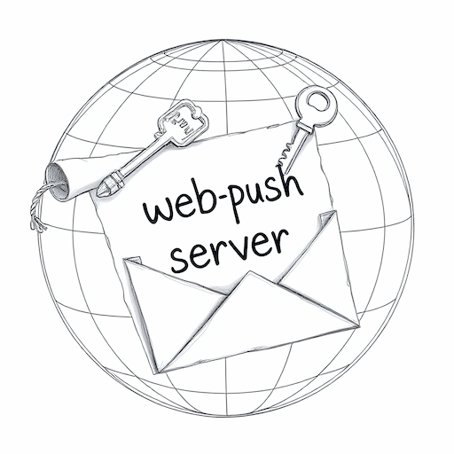

<div align="center">
  
  <br />
  <h1><a href="https://go-webpush.netlify.app/" rel="noopener noreferrer">go-web-push-server</a></h1>
  <strong>A web push server written in Go. 🤖📝</strong>
  <br />
  <br />
  <a href="https://app.netlify.com/sites/go-webpush/deploys"></a> <a href="https://webpush-six.vercel.app"></img></a> 
  <br />
  <br />
  <a href="https://app.netlify.com/start/deploy?repository=https://github.com/saschazar21/go-web-push-server"></a>
 <a href="https://vercel.com/new/clone?repository-url=https%3A%2F%2Fgithub.com%2Fsaschazar21%2Fgo-web-push-server&env=POSTGRES_CONNECTION_STRING,VAPID_EXPIRY_DURATION,VAPID_PRIVATE_KEY,VAPID_SUBJECT,BASIC_AUTH_PASSWORD&envDescription=API%20keys%20needed%20for%20successful%20deployment&envLink=https%3A%2F%2Fgithub.com%2Fsaschazar21%2Fgo-web-push-server%2Fblob%2Fmain%2F.env.sample"></a>
  <br />
  <br />
  <br />
</div>

## What is it?

`go-web-push-server` is a web push server written in Go. It provides a RESTful API to manage web push subscriptions and send push notifications to them.

It may be used as a standalone server, or as a part of a larger application, e.g. a web application or a backend service.

Don't want the full environment? The contained [`webpush`](#source-code) Go package provides as little or as much functionality as currently needed.

## Prerequisites

- Go 1.22
- PostgreSQL 16
- Node.js 20 _(if using Vercel or Netlify local deploy or have enabled demo mode)_

## Environment Variables

Both the server and the contained `webpush` package require the following environment variables to be set:

> ℹ️ **Note**: A new VAPID key pair may be created by executing `go run cli/main.go`.

- `POSTGRES_CONNECTION_STRING`: The connection string to the PostgreSQL database.
- `VAPID_PRIVATE_KEY`: The private VAPID key in PEM format.
- `VAPID_EXPIRY_DURATION`: The duration in seconds for which the VAPID keys are valid.
- `VAPID_SUBJECT`: The subject for the VAPID keys.

Additionally, the server requires the following environment variable for the `/api/v1` endpoints:

- `BASIC_AUTH_PASSWORD`: The password for the basic authentication.

## API

The API is documented using OpenAPI 3.0.0 and can be found at [api_v1.yml](api_v1.yml).

### `POST /api/v1/subscribe`

Creates a new push subscription entry in the database. The request body must contain a structure similar to the following JSON object:

```json
{
  "clientId": "demo",
  "id": "custom", // otherwise a random ID is generated
  "subscription": {
    "endpoint": "https://wns2-par02p.notify.windows.com/w/?token=BQYAAAD5k7SrgAQc4ujYrljNI2FbcNK4vL3u9bzsvB8RHQV5LgdrLkv6(...)",
    "keys": {
      "p256dh": "BPZ_GnkGFYfUcY0D0yMWcAQIuvQfV5tSw_dd7iIQktNR1dhdDflA1eQyJT-0ZSwpDO43mNbBwogEMTh7TCSkuP0",
      "auth": "DGv6ra1nlYgDCS1FRnbzlw"
    }
  }
}
```

### `POST /api/v1/push`

Sends a push notification to all subscribed recipients of the authenticated client. The request body can be virtually anything, however a structure similar to the following JSON object is recommended:

```json
{
  "title": "Hello, World!",
  "body": "This is a test notification.",
  "icon": "https://example.com/icon.png",
  "tag": "test-notification",
  "data": {
    "url": "https://example.com"
  }
}
```

### `POST /api/v1/push/{id}`

Sends a push notification to a single recipient of the authenticated client. The `id` parameter must be a valid recipient ID assigned to the authenticated client.

### `DELETE /api/v1/unsubscribe`

Deletes all subscriptions for a given authenticated client from the database.

### `DELETE /api/v1/unsubscribe/{id}`

Deletes a single subscription from the database. The `id` parameter must be a valid recipient ID assigned to the authenticated client.

## Source Code

Using the `webpush` Go package, the whole functionality of the server can be used in any Go application, even in existing micro-services.

### Storing a Push Subscription

To store a push subscription into the database, the following Go code may be used:

```go
package main

import (
  "context"
  "log"

  "github.com/saschazar21/go-web-push-server/webpush"
)

func main() {
  ctx := context.Background()

  // Create a new push subscription
  subscription := webpush.Subscription{
    ClientID: "demo",
    ID:       "custom",
    Subscription: webpush.PushSubscription{
      Endpoint: "https://wns2-par02p.notify.windows.com/w/?token=BQYAAAD5k7SrgAQc4ujYrljNI2FbcNK4vL3u9bzsvB8RHQV5LgdrLkv6(...)",
      Keys: webpush.Keys{
        P256dh: "BPZ_GnkGFYfUcY0D0yMWcAQIuvQfV5tSw_dd7iIQktNR1dhdDflA1eQyJT-0ZSwpDO43mNbBwogEMTh7TCSkuP0",
        Auth:   "DGv6ra1nlYgDCS1FRnbzlw",
      },
    },
  }

  // Validate the subscription
  err := subscription.Validate()
  if err != nil {
    log.Fatalf("failed to validate subscription: %v", err)
  }

  // Connect to the database, be sure to have POSTGRES_CONNECTION_STRING set
	db, _ := webpush.ConnectToDatabase()

  // Store the subscription in the database
  err := subscription.Save(ctx, db)
  if err != nil {
    log.Fatalf("failed to store subscription: %v", err)
  }
}
```

#### Parsing a Push Subscription from an HTTP Request

Parsing a push subscription from an HTTP request can be done with a single function call:

```go
package main

import (
  "context"
  "log"
  "net/http"

  "github.com/saschazar21/go-web-push-server/webpush"
)

func main() {
  ctx := context.Background()

  // Parse the request body
  r := &http.Request{} // your HTTP request
  subscription, err := webpush.ParseSubscription(r.Body)
  if err != nil {
    log.Fatalf("failed to parse subscription: %v", err)
  }

  // Connect to the database, be sure to have POSTGRES_CONNECTION_STRING set
  db, _ := webpush.ConnectToDatabase()

  // Store the subscription in the database
  err = subscription.Save(ctx, db)
  if err != nil {
    log.Fatalf("failed to store subscription: %v", err)
  }
}
```

### Sending a Push Notification

Sending a push notification to all subscribed recipients of a client can be done with the following Go code:

```go
package main

import (
  "context"
  "log"

  "github.com/saschazar21/go-web-push-server/webpush"
)

func main() {
  // Set the push notification payload
  payload := byte("This is a push notification.")

  // Set the necessary parameters for the push notification
  params := &webpush.WithWebPushParams{
    TTL: 86400, // 48 hours before push message is dropped
  }

  // Provide a push subscription
  subscription := &webpush.PushSubscription{
    Endpoint: "https://wns2-par02p.notify.windows.com/w/?token=BQYAAAD5k7SrgAQc4ujYrljNI2FbcNK4vL3u9bzsvB8RHQV5LgdrLkv6(...)",
    Keys: webpush.Keys{
      P256dh: "BPZ_GnkGFYfUcY0D0yMWcAQIuvQfV5tSw_dd7iIQktNR1dhdDflA1eQyJT-0ZSwpDO43mNbBwogEMTh7TCSkuP0",
      Auth:   "DGv6ra1nlYgDCS1FRnbzlw",
    },
  }

  // Generate all the necessary encryption parameters for the push notification
  push, _ := webpush.NewWebPush(subscription)

  // Send the push notification
  res, err := push.Send(payload, params)
  if err != nil {
    log.Fatalf("failed to send push notification: %v", err)
  }

  log.Printf("push notification sent: %v", res)
}
```

## License

Licensed under the MIT license.

Copyright ©️ 2024 [Sascha Zarhuber](https://sascha.work)
